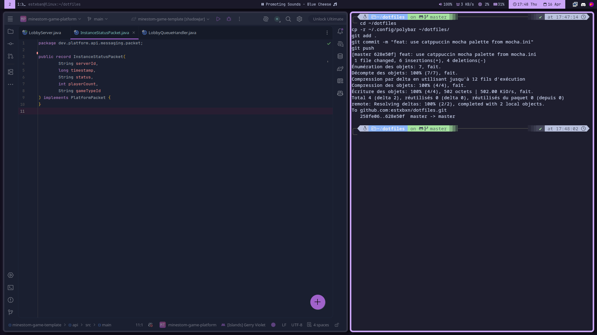

# Dotfiles

My personal dotfiles for EndeavourOS with i3wm, configured for a clean and minimal development environment.



## Setup

- **OS**: EndeavourOS (Arch-based)
- **WM**: i3wm
- **Bar**: Polybar
- **Terminal**: Kitty
- **Shell**: Zsh + Oh My Zsh + Powerlevel10k
- **Launcher**: Rofi
- **Compositor**: Picom
- **Theme**: Catppuccin Mocha

## Installation

```bash
git clone https://github.com/TONPSEUDO/dotfiles.git
cd dotfiles
chmod +x install.sh
./install.sh
```

## Keybindings

| Key | Action |
|-----|--------|
| Super+Enter | Open terminal |
| Super+D | Open rofi |
| Super+Q | Close window |
| Super+R | Resize mode |
| Super+Tab | Switch windows |
| Super+1-9 | Switch workspace |
| Super+Shift+1-9 | Move window to workspace |
| Print | Screenshot |
